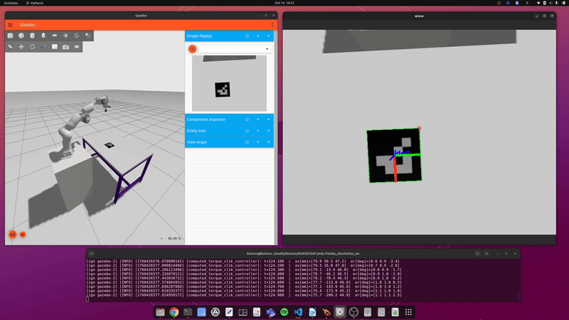

# Setting up the simulation environment for Visual Servoing Exercise

This branch presents a simulation of Franka Panda arm with a camera sensor in gazebo environment. A custom world with an aruco marker is simulated and its pose is estimated by a pose estimation script. Simulation of gazebo sensors ( eg: camera) was part of gazebo classic (EOL 2025) and does not support Ignition gazebo (Fortress/Garden/Harmonic, a.k.a. `gz sim`). In `gz_sim` sensors are first-class `SDF` <sensor> elements. When you simulate an `URDF` file in ignition gazebo ( here after reffered to as gazebo) it is automatically converted to a `SDF` file during spawning. Defining a gazebo sensor inside `URDF` file does not accurfately convert into a working `SDF` file. Therefore, the recommended approach is to convert the `URDF` file to a `SDF` file offline and combine it with a `SDF`file of well defined camera model.





## 1. Installation

### Install and Initialize rosdep
```
sudo apt-get install python3-rosdep
```
If this is the first time using rosdep, it must be initialized via:
```
sudo rosdep init
rosdep update
```
### Download, Create a Workspace, and Build
```
mkdir -p edu-franka_vs_ws/src
cd edu-franka_vs_ws/src
```
Clone the repository:
- Using HTTPS:
  ```
  git clone https://github.com/tau-alma/edu-franka_simulation.git -b visual_serv .
  ```
Install dependencies using rosdep:
```
cd edu-franka_vs_ws
rosdep install --from-paths src -y --ignore-src
```
Build the workspace:
```
colcon build
source install/setup.bash
```
Launch the simulation
```
ros2 launch franka_gazebo launch_with_camera.py
```


## 2. Implementation

- The SDF files of the Franka Panda robot and RGB camera are located at `franka_gazebo/models/panda` and `franka_gazebo/models/rgb_camera`  directories repectively.

- The combined model is at `franka_gazebo/models/panda_with_cam`

- The convertion of `URDF-->SDF ` is done as follows : ( make sure the urdf file exists in the current woorking directory)
    ```
    $ gz sdf -p effort_panda_arm.urdf > effort_panda_arm.sdf
    ```

- An aruco marker is simulated as a model in  `franka_gazebo/models/aruco_marker_0-100mm`. 
    - The `franka_gazebo/models/aruco_marker_0-100mm/materials/textures/aruco_0.png` is generated using the opencv based pathon scripts at `franka_gazebo/scripts/make_aruco.py`
        ```
        $ python3 "$(ros2 pkg prefix --share franka_gazebo)"/scripts/make_aruco.py --id 0 --dict DICT_4X4_50 --pixels 50 --outfile "$(ros2 pkg prefix --share franka_gazebo)"/models/aruco_marker_0_100mm/materials/textures/aruco_0.png
        ```
- A customized gazebo world with models `table` and `aruco_marker_0-100mm` is launched at simulation time located at `franka_gazebo/worlds/cam_world2.py`

- An inverse kinematic controller is configured and controlled using a predefined trajectory from `franka_gazebo/scripts/tri_wave.py`

- Finally, `franka_gazebo/scripts/pose_estimate.py` is an opencv based aruco marker pose estimation ros2 script which subscribes to rgb topics and visualizes estimated poses and display on an opencv window.


In addition following information are provided for your reference
## 3. Gazebo basics

Familiarize yourself with basics if you are new to gazebo environment at [gazebosim.org](gazebosim.org)

- [Simulating worlds and models in gazebo](https://gazebosim.org/docs/latest/building_robot/)
- [Adding more functionalities to gazebo world](https://gazebosim.org/docs/latest/building_robot/)
- [Spawning a custom gazebo world in ROS2 launch file](https://gazebosim.org/docs/latest/ros2_launch_gazebo/)
- [Bridging messages between ignition transport and ROS2](https://gazebosim.org/docs/latest/ros2_integration/)

## 4. Opencv Aruco

- Aruco marker creation and pose estimation is adopted from the opencv [documenatation](https://docs.opencv.org/3.4/d5/dae/tutorial_aruco_detection.html) 


